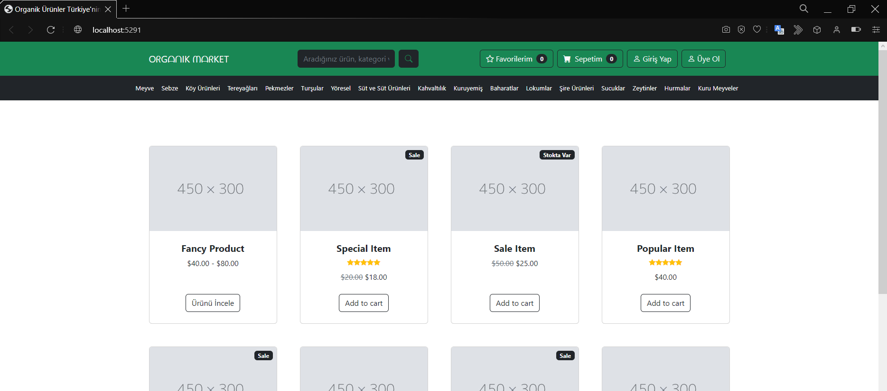
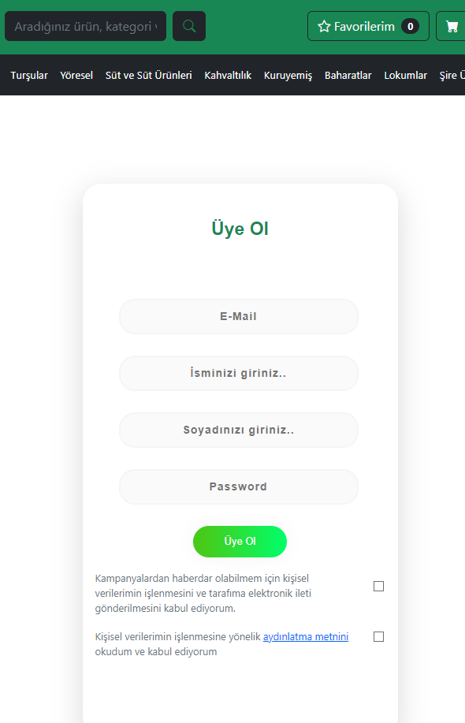
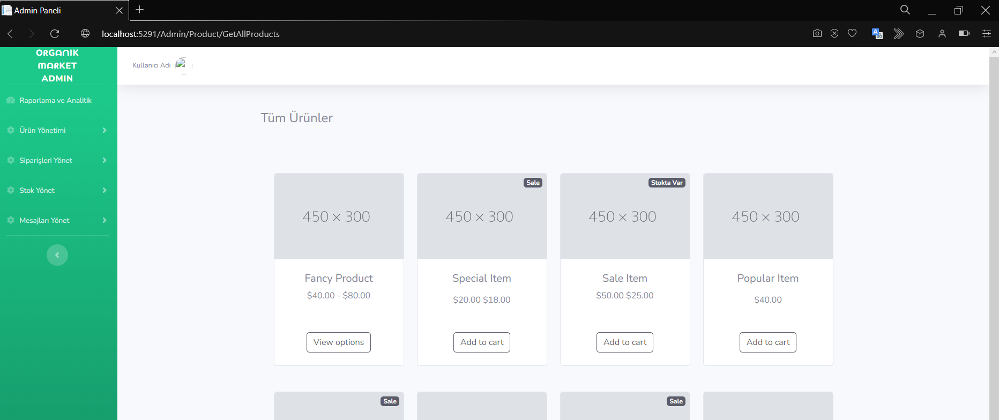

# Organic Market

Şu an yazmaya devam etmekte olduğum MVC projem... Projemin teması organik ürünlerin satıldığı online e-ticaret sitesidir. Bu sitede organik ürün üreticileri ürünlerini sisteme yükler ve ürünler tüketiciler ile buluşur. 

## Proje Kullandığım mimariler ve kütüphaneler

- Bu projemde Onion Architecture mimarisini kullandım.
- FluentValidation
- AutoMapper
- ASP.NetCore Identity
- NToastNotify
- Entity Framework

## Projemden Görseller

